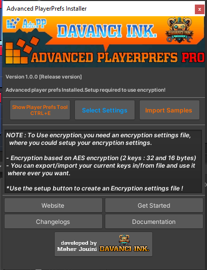
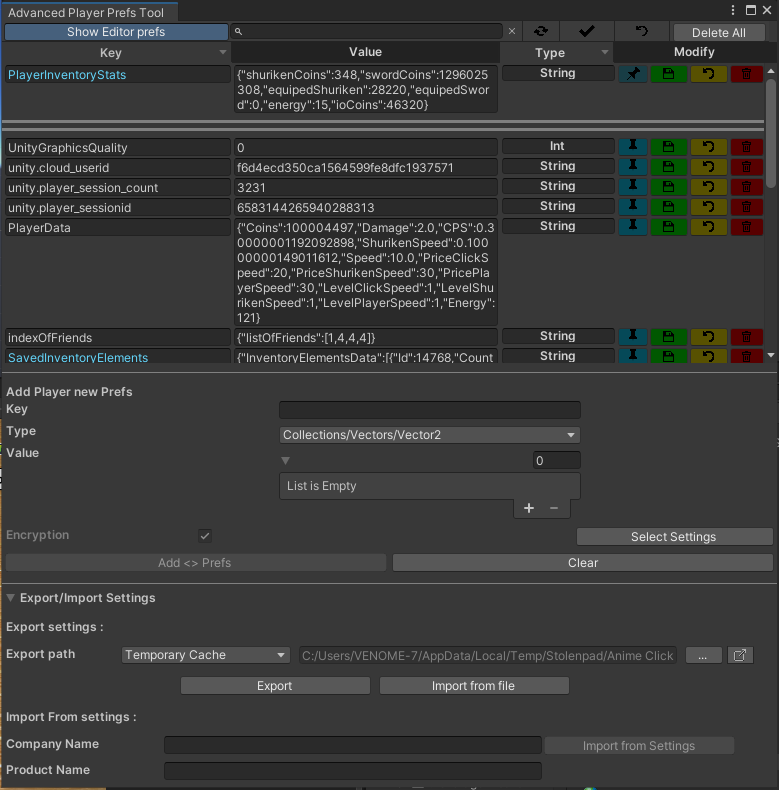
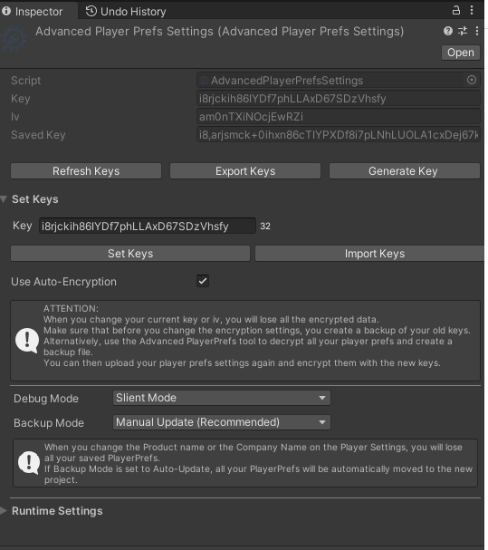

# Advanced Playerprefs

## Description
This repository contains the source code and assets for the Advanced PlayerPrefs Unity asset, a powerful tool that enhances the PlayerPrefs system in Unity. It provides secure and efficient storage and management of player preferences, with advanced encryption techniques and a user-friendly editor tool.

## Features
- Secure Encryption: Safely store and retrieve player preferences with advanced encryption techniques.
- Wide Range of Data Types: Support for various data types including strings, integers, booleans, doubles, longs, vectors, colors, date times, and collections like arrays and lists.
- Easy-to-Use API: Simple API for setting and getting player preferences.
- Decryption of Saved Data: Retrieve and decrypt previously saved data.
- User-Friendly Editor Tool: Manage player preferences from within the Unity Editor.
- Export and Import Preferences: Backup and transfer player preferences using import and export options.
- "Device Key" Mode: Generate a unique encryption key for each device, enhancing data security.
- Customizable Encryption Settings: Adjust encryption settings to suit your requirements.
- Support for Multiple Encryption Algorithms: Choose from a variety of encryption algorithms.
- Custom Encryption Keys: Set and manage custom encryption keys.
- Encryption Key Export and Import: Export and import custom encryption keys for convenience and security.

## Screenshots

## Encryption and Security

Advanced PlayerPrefs offers secure encryption to protect player data. You can set custom encryption keys and export/import them for backup, transfer, or sharing across projects or team members. The encryption key can be exported as a file in a preferred format (e.g., JSON or XML). Please ensure that you keep the exported encryption keys file secure and don't share it with unauthorized individuals.

## Advanced Usage
- Backup and restore player preferences using the Editor Tool's import and export features.
- Decrypt data on different platforms or devices using the encryption key.
- Enable "Device Key" mode to generate a unique encryption key for each device, enhancing security.
- Reset the game to its original state by deleting all player preferences.
- Utilize the API to interact with Advanced PlayerPrefs and handle preferences effectively.

## Dependencies
- Unity: [Unity Download](https://unity.com/)

## Contributing
Contributions to this project are currently not accepted as it is an unfinished prototype. However, feel free to fork the repository and make your modifications for personal or educational use.

## License
This project is licensed under the [MIT License](LICENSE). Feel free to use and modify the code for your own purposes.

## Acknowledgements
- [Unity](https://unity.com/) - Game development engine used for the project.

## Contact
For any questions or inquiries, please contact [Meher Jouini](mailto:jouin.meherr@gmail.com).
